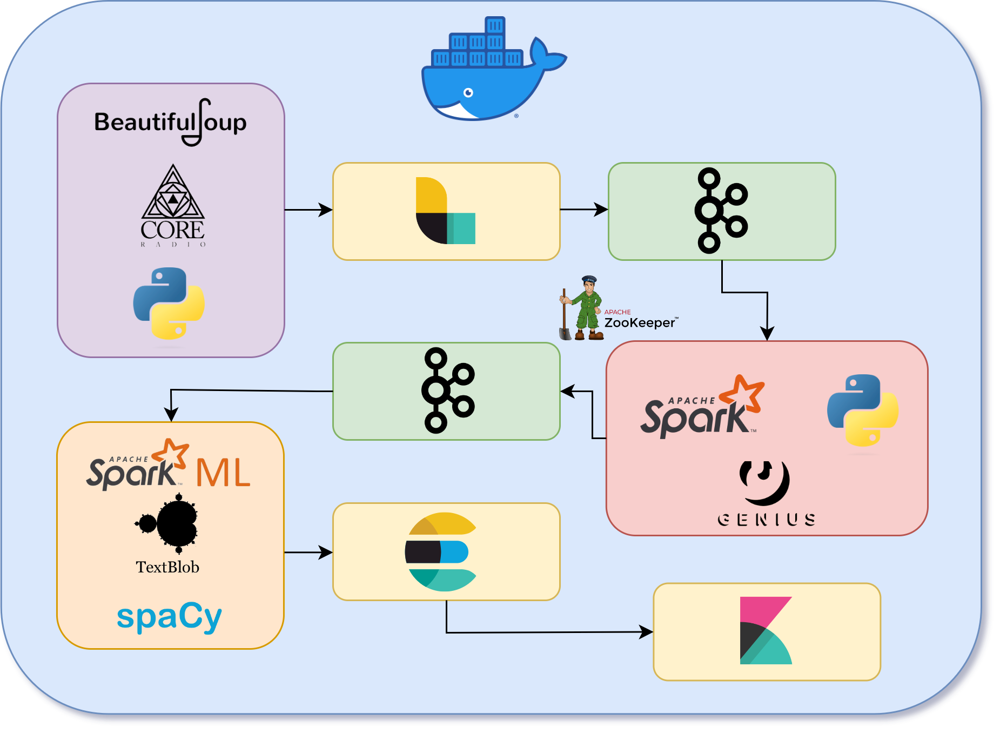
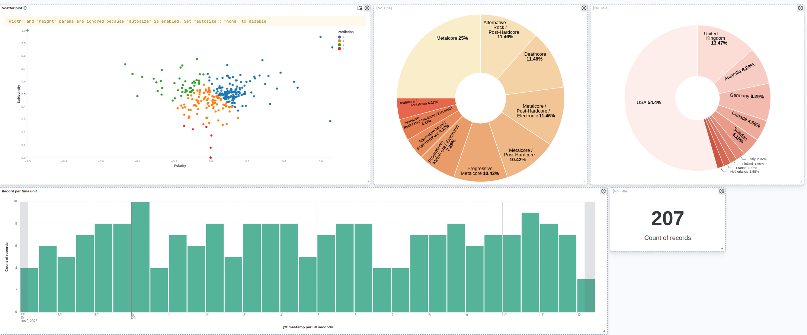

# FeelsCore
Developed by **Antonio Finocchiaro** and **Riccardo Cuccia**, this project is part of the **Technologies For Advanced Programming** course at the University of Catania.

## Project Goal

The goal of this project is to develop a system capable of updating the list of latest releases in the music scenario, and to provide a real-time analysis of the emotions that the song is able to transmit to the listener.

## Technologies used
<ul>
<li> <strong>Web Scraping</strong>: <a href="https://www.crummy.com/software/BeautifulSoup/bs4/doc/">BeautifulSoup</a> and <a href="https://docs.genius.com">Genius API</a></li>
<li> <strong>Centralized service</strong>: <a href="https://zookeeper.apache.org/">Zookeeper</a></li>
<li> <strong>Data Ingestion</strong>: <a href="https://www.elastic.co/logstash/">Logstash</a></li>
<li><strong>Data Streaming</strong>: <a href="https://www.confluent.io/what-is-apache-kafka/">Apache Kafka</a> and <a href="https://spark.apache.org/docs/latest/structured-streaming-programming-guide.html">Spark Structured Streaming</a></li>
<li><strong>Data Processing</strong>: <a href="https://spark.apache.org/">Apache Spark</a> with <a href="https://spark.apache.org/docs/1.2.2/ml-guide.html">SparkML</a>, <a href="https://spacy.io">Spacy</a> and <a href="https://textblob.readthedocs.io/en/dev/">TextBlob</a></li>
<li><strong>Data Indexing</strong>: <a href="https://www.elastic.co/what-is/elasticsearch">Elasticsearch</a></li>
<li><strong>Data Visualization</strong>: <a href="https://www.elastic.co/what-is/kibana">Kibana</a></li>
</ul>

## Project Structure

## How to execute the project

### Downloads
<ul>
<li><strong>Apache Kafka</strong>: download from <a href="https://dlcdn.apache.org/kafka/3.4.0/kafka_2.13-3.4.0.tgz">here</a> and put the tgz file into Kafka/Setup directory.</li>
<li><strong>Apache Spark</strong>: download from <a href="https://dlcdn.apache.org/spark/spark-3.4.0/spark-3.4.0-bin-hadoop3.tgz">here</a> and put the tgz file into Spark/Setup directory.</li>
</ul>

### Initial setup
Execute <code>python3 starter.py</code> in the main folder. This script will build the docker images for the project.

### Start project
After the previous step is completed, the project can be started by using the code <code>docker-compose up</code>

### Show results
Here are the addresses to see the results of the project:
<ul>
<li><strong>Kafka UI</strong>: <a href="http://localhost:9600">http://localhost:8080</a></li>
<li><strong>Kafka Server</strong>: <a href="http://localhost:9092">http://localhost:9092</a></li>
<li><strong>Kibana</strong>: <a href="http://localhost:5601">http://localhost:5601</a></li>
<li><strong>Logstash</strong>: <a href="http://localhost:5092">http://localhost:5092</a></li>
<li><strong>ElasticSearch</strong>: <a href="http://localhost:9200">http://localhost:9200</a></li>
</ul>

### Kibana Dashboard

